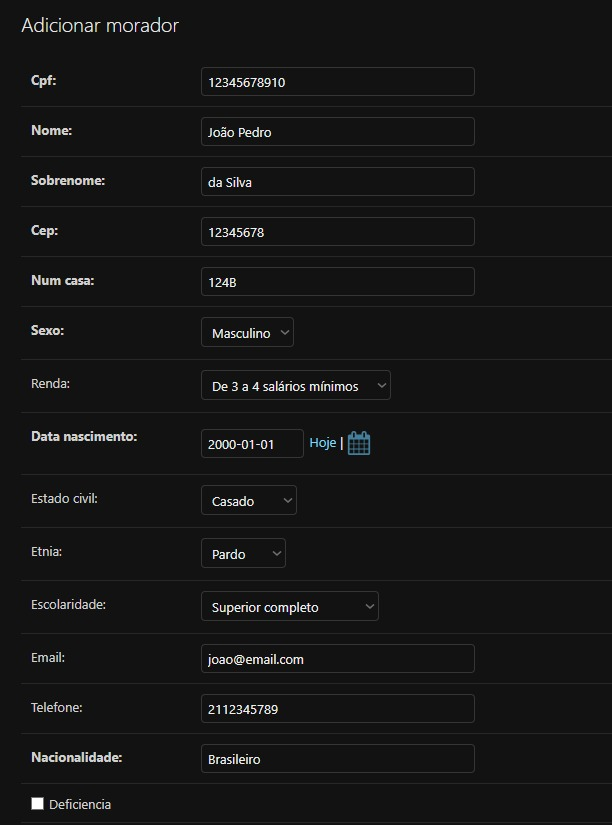

# Stack-UnderFlow

## Índice

- [Alunos](#alunos)
- [Mapa Mental](#mapa-mental)
- [Sobre](#sobre)
- [Screenshots](#screenshots)
- [Instalação](#instalação)
- [Uso](#uso)
- [Vídeo](#vídeo)
- [Documentação](#documentação)

## Alunos
**Número do Grupo**: II<br>
**Turma**: 8002<br>

|Matrícula | Aluno |
| -- | -- |
| 202401000833  |  Eduardo Peruzzo |
| 202401000493  |  Pedro dos Santos |
| 202402159216  |  Vinicius da Luz |
| 202402898892  |  Bárbara Malta |
| 202403184672  |  Mateus Sachinho |

## Mapa mental

[Mapa mental no canva](https://www.canva.com/design/DAGi2i6MryE/OP75rrcf3gHED32h_s2GKg/view?utm_content=DAGi2i6MryE&utm_campaign=designshare&utm_medium=link2&utm_source=uniquelinks&utlId=h5929975859)

## Sobre
Esse projeto é um sistema desenvolvido como parte do projeto de extensão da disciplina Projeto Back-End. O sistema tem como objetivo coletar, armazenar e gerenciar dados de um censo demográfico da Ilha Primeira, permitindo que os usuários cadastrem informações sobre domicílios, moradores e aspectos socioeconômicos da população.

O projeto foi desenvolvido utilizando o framework Django (Python), com foco em criar um sistema web funcional, intuitivo e com interface de administração, além de contar com documentação completa via MkDocs.

## Screenshots

OBS: Screenshots foram tiradas da interface do Django Admin

### Informações de Morador



### Informações de Domicílio


### Informações de Indicadores


## Instalação
Essa seção trata sobre como instalar o projeto e rodá-lo localmente.

Pré-requisitos:
- Python 3.10 ou superior
- Git
- Pip (gerenciador de pacotes do Python)

### Clone o repositório
```
git clone https://github.com/Projetos-de-Extensao/PBE_25.1_8002_Stack-UnderFlow.git
cd PBE_25.1_8002_Stack-UnderFlow
```
### Crie um ambiente virtual (opcional, mas recomendado)
```
python -m venv venv
source venv/bin/activate  # Linux/Mac
venv\Scripts\activate     # Windows
```
### Instale as dependências
```
pip install -r requirements.txt
```
### Acesse a pasta do projeto Django e aplique as migrações
```
cd src
python manage.py makemigrations
python manage.py migrate
```
### Crie um superusuário (para acessar o admin)
```
python manage.py createsuperuser
Siga as instruções no terminal para definir usuário e senha.
```
### Execute o servidor local
```
python manage.py runserver
```
Acesse o sistema em:
http://127.0.0.1:8000/

## Uso
Com o projeto rodando em um servidor (seja local ou web), basta consumir a API criada pelo Django nos endpoints:
- api/moradores/
- api/indicadores/
- api/domicilios/

Mais detalhes sobre o uso da API e sobre os tipos de dados podem ser vistos no próprio endereço do servidor, no endereço "/swagger".

## Vídeo
Vídeo de demonstração do funcionamento do sistema: [Vídeo](https://drive.google.com/file/d/1bUYTL2XIgdUrUFwqgkidMXN-O4wdSV5L/view)

## Documentação
A documentação do sistema pode ser encontrada em: [https://projetos-de-extensao.github.io/PBE_25.1_8002_Stack-UnderFlow/](https://projetos-de-extensao.github.io/PBE_25.1_8002_Stack-UnderFlow/)
