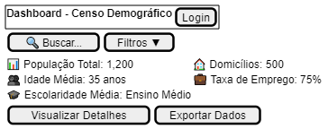
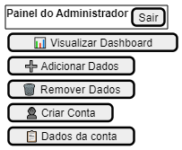
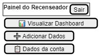
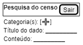

## Introdução

A construção do protótipo auxilia a equipe de desenvolvimento a entender melhor o escopo do projeto e quais funcionalidades devem ser feitas com prioridade.

## Metodologia

Iniciamos o protótipo através dos levantamentos iniciais da equipe, utlizando a ferramenta PlantUML para criar os designs iniciais de forma simples e facilmente versionável.

](../../assets/Prototipo/dashboard.png)

](../../assets/Prototipo/adm.png)

](../../assets/Prototipo/recenseador.png)

](../../assets/Prototipo/pesquisa.png)
