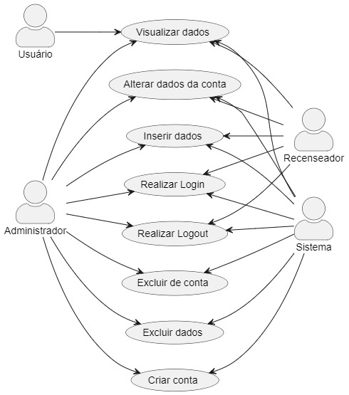

## Lista:

---

### Conta

- [Criação](#criacao-de-conta-no-sistema)
- [Log in](#log-in-no-sistema)
- [Log out](#log-out-no-sistema)
- [Exclusão](#exclusao-de-conta)
- [Alteração de senha](#alteracao-de-senha)

### Dados

- [Inserção](#insercao-de-dado)
- [Exclusão](#exclusao-de-dado)
- [Visualização](#visualizacao)

---

## Documentação:

---

### Criação de conta no sistema

- Atores:
    - Administrador
    - Sistema
- Pré-condições:
    - Administrador está logado.
- Fluxo Básico:
    1. O administrador dá início ao processo de criação de conta
    2. O administrador define se a conta é de um Administrador ou Recenseador
    3. O administrador atribui um E-mail e uma senha à conta
    4. Os dados inseridos são validados pelo sistema
    5. A conta é registrada no sistema
- Fluxo Alternativo:
    - 2a. E-mail atribuído é inválido.
        - 2a1. Sistema exibe uma mensagem de erro e permite que outro E-mail seja inserido.
    - 2b. Senha atribuída não cumpre os requisitos mínimos do sistema.
        - 2b1. Sistema exibe uma mensagem de erro e permite que outra senha seja inserida.

---

### Log in no sistema

- Atores
    - Administrador
    - Recenseador
    - Sistema
- Pré-condições:
    - Usuário possui uma conta
- Fluxo básico:
    1. Usuário entra na tela de Log in
    2. Usuário insere o E-mail e senha de sua conta
    3. Sistema valida as informações inseridas
    4. Usuário é logado no sistema
- Fluxo Alternativo:
    - 2a. E-mail inserido é inválido
        - 2a1. Sistema exibe uma mensagem de erro e permite que outro E-mail seja inserido
    - 2b. E-mail válido porém senha incorreta
        - 2b1. Sistema exibe uma mensagem de “senha incorreta” e permite que outra senha seja inserida

---

### Log out no sistema

- Atores
    - Administrador
    - Recenseador
    - Sistema
- Pré-condições:
    - Usuário está logado
- Fluxo Básico:
    1. Usuário seleciona a opção de “Log out”
    2. Usuário é deslogado do sistema
- Fluxo Alternativo:
    - Nenhum

---

### Exclusão de conta

- Atores
    - Administrador
    - Sistema
- Pré-condições:
    - O administrador está logado
- Fluxo Básico:
    1. Administrador seleciona uma conta existente
    2. Administrador seleciona a opção de excluir conta
    3. Sistema exibe um painel e requere a senha do administrador como código de confirmação
    4. Administrador insere sua senha como código de confirmação
    5. A conta é excluída
- Fluxo Alternativo:
    - 2a. Senha inserida pelo Administrador incorreta
        - 2a1. O sistema exibe uma mensagem de “senha incorreta” e permite que o usuário insira outra senha.

---

### Alteração de senha

- Atores
    - Administrador
    - Recenseador
    - Sistema
- Pré-condições:
    - O usuário possui uma conta
- Fluxo Básico:
    1. Usuário clica na opção de alteração de senha
    2. Sistema envia um código de verificação ao E-mail registrado na conta com prazo para inserção
    3. Sistema exibe uma caixa para a inserção do código de verificação
    4. Usuário insere o código de verificação
    5. Sistema exibe uma tela de alteração de senha
    6. Usuário confirma a alteração
    7. Sistema registra a nova senha
- Fluxo Alternativo:
    - 2a. Usuário insere um código de verificação incorreto
        - 2a1. Sistema exibe uma mensagem “código de verificação incorreto” e permite que o usuário insira o código novamente
    - 2b. Nova senha inserida não cumpre os requisitos mínimos do sistema
        - 2b1. Sistema exibe uma mensagem de erro e permite que o usuário insira uma nova senha
    - 2c. Usuário insere o código após seu prazo de inserção
        - 2c1. Sistema exibe uma mensagem “prazo de inserção expirado”
        - 2c2. Sistema envia um novo código de verificação ao E-mail registrado

---

### Inserção de dado

- Atores
    - Recenseador
    - Administrador
    - Sistema
- Pré-condições:
    - O usuário está logado como recenseador ou administrador
- Fluxo Básico:
    1. Usuário clica na opção de adicionar dado
    2. Sistema exibe uma tela para o preenchimento das informações sobre o dado
    3. Usuário preenche os campos e confirma a criação do dado
    4. Sistema registra o dado e suas informações
- Fluxo Alternativo:
    - 2a. Usuário confirma a criação do dado sem preencher todos os campos de informação
        - 2a1. Sistema exibe uma mensagem de erro e permite que o usuário preencha os campos faltando

---

### Exclusão de dado

- Atores
    - Administrador
    - Sistema
- Pré-condições:
    - O usuário está logado como administrador
- Fluxo Básico:
    1. Administrador clica na opção de excluir dado
    2. Sistema exibe um painel e requere a senha do administrador como código de confirmação
    3. Administrador insere sua senha como código de confirmação
    4. Sistema exclui o dado de seus registros
- Fluxo Alternativo:
    - 2a. Administrador insere uma senha incorreta
        - 2a1. Sistema exibe uma mensagem “senha incorreta” e permite que o administrador insira outra senha

---

### Visualização

- Atores
    - Usuário
    - Sistema
- Pré-condições:
    - O sistema possui dados disponíveis
- Fluxo Básico:
    1. Usuário acessa o dashboard de dados
    2. Sistema monta o dashboard com base nos seus dados armazenados
    3. Sistema exibe o dashboard
- Fluxo Alternativo:
    - 2a. Sistema não possui dados disponíveis
        - 2a1. Sistema exibe uma mensagem informando sobre a falta de dados
        - 2a.2 Sistema exibe uma opção de voltar para a página anterior
    - 2b. Sistema falha no carregamento dos dados do dashboard
        - 2b1. Sistema exibe uma mensagem de erro
        - 2a.2 Sistema exibe uma opção para recarregar a página e outra para retornar à página anterior

---

## Diagrama de Casos de Uso

](../../assets/Casos_de_Uso/diagrama_casos_de_uso.jpg)