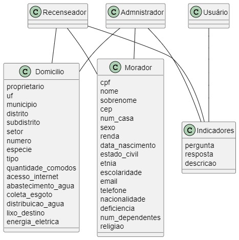

## Introdução

O diagrama de classes UML é um diagrama que mostra a estrutura do sistema desenhado no nível de classes e interfaces, ilustra as funcionalidades, dependências e relacionamentos de cada elemento. Pode ser vista como uma representação visual da arquitetura de um sistema.

## Metodologia

Para a criação da primeira versão do diagrama de classes, a equipe utilizou o PlantUML. Além disso, foi utilizado o Visual Studio Code para elaboração da documentação.

## Diagrama de Classes

](../../assets/Diagrama_classes/diagrama1.png)

## Conclusão

Através do diagrama de classes, foi possível representar a estrutura do sistema a nível de classes e auxiliar na modelagem da arquitetura geral, além do banco de dados. Ao longo do desenvolvimento da disciplina, iremos adaptar e evoluir o diagrama e sua documentação para refletir no estado atual do projeto.

