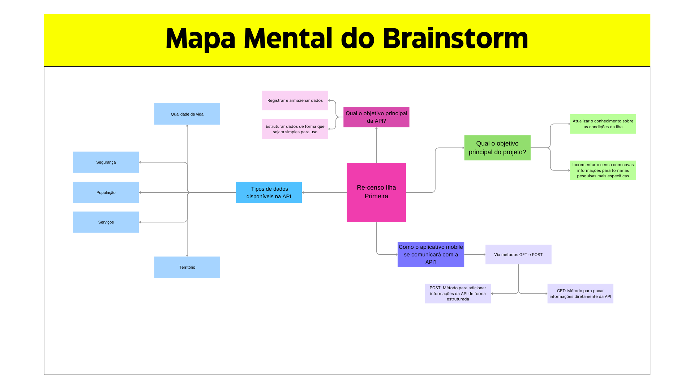

# Stack-UnderFlow

**Número do Grupo**: II 
**Turma**: 8002 

## Alunos
|Matrícula | Aluno |
| -- | -- |
| 202401000833  |  Eduardo Peruzzo |
| 202401000493  |  Pedro dos Santos |
| 202402159216  |  Vinicius da Luz |
| 202402898892  |  Bárbara Malta |
| 202403184672  |  Mateus Sachinho |

## Mapa mental

](./assets/Mapas_mentais/Mapa_Mental_do_Brainstorm.png)

## Sobre
Descreva o seu projeto em linhas gerais.

## Screenshots
Adicione 3 ou mais screenshots do projeto em termos de interface e funcionamento.

## Instalação
**Linguagens**: xxxxxx 
**Tecnologias**: xxxxxx 
Descreva os pré-requisitos para rodar o seu projeto e os comandos necessários.
Insira um manual ou um script para auxiliar ainda mais.

## Uso
Explique como usar seu projeto caso haja algum passo a passo após o comando de execução.

## Vídeo
Adicione 1 ou mais vídeos com a execução do projeto final.

## Outros
Quaisquer outras informações sobre seu projeto podem ser descritas abaixo.
